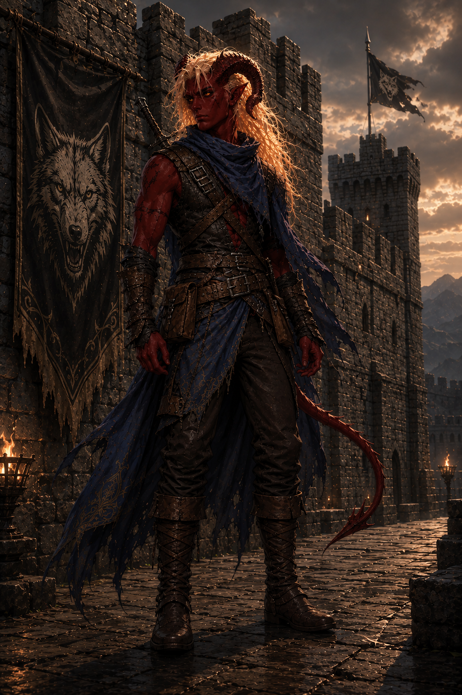

---
cssclasses:
  - wide-page
  - wide-backlinks
dateCreated:
tags:
  - character
aliases:
  - Aldrick
  - Aldrich [[Havenport]]
date:
image_name:
---

  
  

## Summary

Aldrich came to [[Everdale]] for the [[King's Tourney]] and had not personally visited the human capital before this session. Source: [[2026.05.05|2026.05.05]].

## Current Notes

- Aldrich is from a settlement "decently far" away that he described as somewhere between a town and a growing small city. Source: [[2026.05.05|2026.05.05]].
- He once served as a soldier or security for a [[House Troth|vassal house]] under [[House Wulfhelm]]. Source: [[2026.05.05|2026.05.05]].
- He bought a bottle of [[Minnie]]'s huckleberry mead and plans to save it for a victory celebration after the tourney. Source: [[2026.05.05|2026.05.05]].
- He joined **Cassian's Crushing Crusaders** for the Proving Grounds. See [[Compete in the King's Tourney]]. Source: [[2026.05.05|2026.05.05]].
- He recognized [[Kardis Wulfhelm]] as a prince of House Wulfhelm and made a joke about hoping Kardis's blade was not as sharp as his eyebrows. Source: [[2026.05.05|2026.05.05]].
- After learning [[Jevon]] was taken, Aldrich wanted to look for a smithy before the group regrouped at sundown. Source: [[2026.05.05|2026.05.05]].
- He took 4 necrotic damage from the possessed knight at the [[Stone Sanctum]] graveyard, reducing his max HP by 4 until a long rest. This was healed after sleeping in [[Boarhead Tor]]. Source: [[2026.05.12|2026.05.12]], [[2026.05.19|2026.05.19]].
- He was awarded a **Sentinel Shield** by [[Gruvelda Duskbelt]] as payment for the ghost job: blue dwarven craftsmanship with an eye emblem, granting advantage on initiative rolls and perception checks. Requires an action to equip or stow—a trade-off between two-handed great sword offense and defensive shielded stance. Source: [[2026.05.19|2026.05.19]].
- He contributes 1 gold to [[Cassian]]'s 5-gold wager that the party wins their first bout without anyone being incapacitated. Aldrich gets free drinks from Cassian if they lose. Source: [[2026.05.19|2026.05.19]].
- Aldrich keeps a mental book of prepared jokes and delivered one to the downed knight at the Stone Sanctum: _"You picked a bad day to be ugly."_ Source: [[2026.05.12|2026.05.12]].
- In the party's first Proving Grounds bout, Aldrich was the last party member standing while both [[Cassian]] and [[Azrith]] were downed. He used Evasive Footwork (Battle Master maneuver, expending 3 superiority dice) to disengage and boost his AC to 27 for a round. He landed a natural 20 Firebolt crit on one fighter (17 fire damage), applied his greatsword's Graze mastery for 5 slashing to fell the large frontliner, and claimed two knockouts. He quipped over the large enemy's downed body: _"I expected more. That's on me."_ Source: [[2026.06.02|2026.06.02]].
- Received **Combat Greaves** from [[Duke Tristan Blackwood]]'s sponsorship delivery at [[Clover Hill]]: grants +5 ft of movement on the first round of each combat. Source: [[2026.06.11|2026.06.11]].
- Registered the party for the **Crown Gauntlet** (obstacle course format); bout scheduled **7 PM, Tent A**. Source: [[2026.06.11|2026.06.11]].
- Visited [[Gruvelda Duskbelt]]'s smithing tent to discuss lighter armor. Options presented: breastplate (250 gp, AC 17, no stealth disadvantage) or half plate (500 gp discounted from 750, AC 18, no stealth disadvantage). Decided to keep his current chain mail and forgo the upgrade. He accidentally called Gruvelda "Griselda"—she raised an eyebrow and gave him a hard look. Source: [[2026.06.11|2026.06.11]].
- During the [[Crown Gauntlet]], [[Cassian]] tossed Aldrich his **Chain of the Unbroken** mid-combat ("Catch, my friend!"); Aldrich used it through the rest of the challenge, though its full magical properties remain unidentified. Source: [[2026.06.23|2026.06.23]].
- In the Gauntlet's conclusion, Aldrich burned his one Heroic Inspiration reroll to clear the sheer wall climb, took a natural-20 sack throw for 8 bludgeoning that nearly knocked him off a rotating platform (clawed back up), and helped haul [[Odine Dunmere]] to safety in the final rescue (a "Brutus drag" athletics check). Afterward he asked to retrieve a javelin he'd thrown and lost in the mud. Source: [[2026.07.14|2026.07.14]].
- Received a **+1 Greatsword** bearing House Blackwood's crest as part of [[Duke Tristan Blackwood]]'s Crown Gauntlet victory reward, delivered by his nephew [[Renny Blackwood]]. Source: [[2026.08.11|2026.08.11]].
- Stole an entire barrel of mead from [[Rory]] at the [[Ragged Flagon]] via Sleight of Hand (rolled 19), completely undetected. Source: [[2026.08.11|2026.08.11]].
- Commissioned upgraded armor from [[Gruvelda Duskbelt]]: blue-dyed, scale-shaped splint/plate armor for 200 gp (100 gp deposit paid, 8 hours to complete), replacing his worn chain mail. Source: [[2026.08.11|2026.08.11]].
- During the long rest, Aldrich's private thoughts turned to what comes after the tourney—whether he'll stay with the party or whether everyone will go their own way once it's over. Source: [[2026.08.11|2026.08.11]].
- Confirmed his former house as **[[House Troth]]**, a minor vassal of [[House Wulfhelm]]; served as rank-and-file guard/security, not nobility, and hails from "the seaside." Duke Blackwood advised keeping the connection quiet. Source: [[2026.08.18|2026.08.18]].
- **Won the King's Cup**, Rory's weekly drinking tournament at the [[Ragged Flagon]]—out-drinking ~18 rivals including a dwarf who died from the tournament's final round. Burned his Heroic Inspiration to survive the frost-giant liqueur round; ended the night at **exhaustion level 6**, functionally incapacitated. Reward: 90 gp and an oversized ornate brass drinking mug. Declared afterward: _"I might have found my place in this world."_ Source: [[2026.08.18|2026.08.18]].
- Treated overnight by [[Father Kaldus Vey]] at the King's Fair healer tents: repeated Greater Restoration castings (400 gp total, paid by the party) plus a long rest cleared his exhaustion from level 6 down to 2; he then slept through the following day to clear one more level, ending at **exhaustion level 1** ahead of the Menagerie bout. Woke in borrowed Royal Chapel robes and fielded the priest's gentle questions about his "blood curse" tiefling heritage. Source: [[2026.08.25|2026.08.25]].
- Finalized his commissioned **splint armor** (blue-dyed, scale-shaped) ahead of the Menagerie bout against a manticore. Source: [[2026.08.25|2026.08.25]].
- In the manticore bout, missed both of his own sword swings (including a Heroic Inspiration reroll) while jumping at the airborne beast. Caught on to [[Cassian]]'s plan to talk the manticore down and **shoved [[Azrith]] out of melee** with a natural-20 Athletics check to stop him attacking. Used Thaumaturgy's phantom sound and booming voice to whisper unsettling phrases into the judges' box, sowing confusion among the officials (Intimidation 9, called a moderate success). Tossed Azrith a healing potion after the bout. Source: [[2026.09.08|2026.09.08]].
- Capped the escape from the Menagerie by casting Firebolt into the arena's outer tents and banners as a parting smokescreen. Praised by patrons at the [[Ragged Flagon]] afterward for the flair. Source: [[2026.09.15|2026.09.15]].
- Reacted oddly when [[Duke Tristan Blackwood]] named their destination as [[Havenport]]—his own surname, known to him only from family bedtime stories. Held a private, undisclosed conversation with the GM about it; the connection to his backstory is unresolved. Source: [[2026.09.15|2026.09.15]].
- Reached **level 5**, gaining Extra Attack. Source: [[2026.09.15|2026.09.15]].

## Relationships

- [[Cassian]]: fellow member of the tourney team.
- [[Azrith]]: fellow member of the tourney team.
- [[Odine Dunmere]]: fellow member of the tourney team.
- [[House Wulfhelm]]: parent house of the [[House Troth|vassal house]] Aldrich once served.
