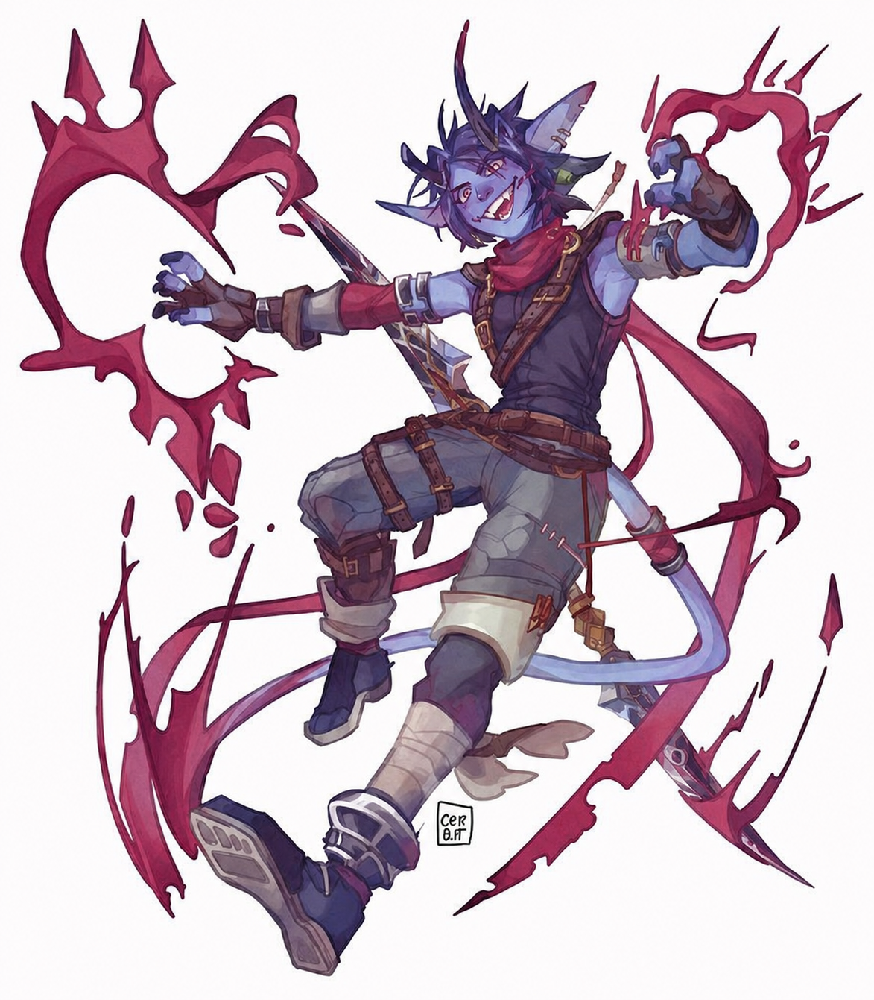

---
cssclasses:
  - wide-page
  - wide-backlinks
dateCreated:
tags:
  - character
aliases:
  - Azrith Duskrin
date:
image_name:
---

  
  

## Summary

Azrith is energetic, curious, and easily drawn toward odd or spooky things. He traveled with the party into [[Everdale]] for the [[King's Tourney]]. Source: [[00 - Game Log/2026.05.05|2026.05.05]].

## Current Notes

- Azrith spent the morning at camp climbing trees while the rest of the group prepared to travel. Source: [[00 - Game Log/2026.05.05|2026.05.05]].
- [[Marea Voss]] referred to him as her "horned friend," confirming Azrith has visible horns. Source: [[00 - Game Log/2026.05.05|2026.05.05]].
- His background includes travel through the Crownlands among merchant or slaver routes, giving him some familiarity with the region but not necessarily with Everdale itself. Source: [[00 - Game Log/2026.05.05|2026.05.05]].
- He joined **Cassian's Crushing Crusaders** for the Proving Grounds and signed the registration sheet with rough handwriting plus a note to "don't forget it." See [[Compete in the King's Tourney]]. Source: [[00 - Game Log/2026.05.05|2026.05.05]].
- He noticed [[Jevon]]'s magical box glinting in the muddy cart tracks after the party left [[Marea Voss]]' apothecary. See [[Rescue Jevon]]. Source: [[00 - Game Log/2026.05.05|2026.05.05]].
- He misremembered Jevon's name as "Kevin," which became a table joke. Source: [[00 - Game Log/2026.05.05|2026.05.05]].
- He caught [[Gruvelda Duskbelt]]'s attention by using Thaumaturgy to conjure ghostly moans around her smithing tent, pitching the party as ghost hunters available to solve her problem. His persuasion roll (25) secured the deal. Source: [[00 - Game Log/2026.05.12|2026.05.12]].
- His supernatural senses and a high investigation roll (23) led the party to the [[Stone Sanctum]] in the Everdale hamlet. Source: [[00 - Game Log/2026.05.12|2026.05.12]].
- He has a Crimson Rite ability—specifically the Rite of Dawn. Activating it deals 1d4 necrotic damage to his own hand but grants resistance to necrotic damage, sheds bright light in a 20-foot radius, and adds bonus radiant damage against undead. His first known use was against the possessed knight at the Stone Sanctum. Source: [[00 - Game Log/2026.05.12|2026.05.12]].
- He took a critical life drain hit from the possessed knight (natural 20), reducing his max HP to 12 until a long rest. This was fully healed after the long rest in [[Boarhead Tor]]. Source: [[00 - Game Log/2026.05.12|2026.05.12]], [[00 - Game Log/2026.05.19|2026.05.19]].
- He finished the possessed knight with a magical scimitar strike, triggering the ghost's submission and dissipation. Source: [[00 - Game Log/2026.05.12|2026.05.12]].
- He spotted [[Gruvelda Duskbelt]] hiding under a hood at the [[Ragged Flagon]] with a natural 20 perception roll, recognizing her despite the disguise. Source: [[00 - Game Log/2026.05.19|2026.05.19]].
- He was awake while [[Cassian]] had his dream visit from [[The Masked Figure]]; Cassian covered for the dream by claiming he had dreamed about a woman. Source: [[00 - Game Log/2026.05.19|2026.05.19]].
- In the party's first Proving Grounds bout, Azrith opened by casting Bless on three party members (1d4 bonus to all attack rolls and saving throws, 1-minute concentration), which carried the party through most of the fight. He landed Chill Touch (natural 20, 7 necrotic) and activated his Hematurgy. He was later critted for 21 slashing damage and incapacitated, dropping Bless. He made a successful death save (13). [[Cassian]] revived him with Healing Hands (6 HP, while using Azrith's horn as a handhold to get up). Azrith delivered the final blow with a Chill Touch natural 20 crit—placing a ghostly hand on the last fighter's chest, leaving a necrotic scar as the match was called. Source: [[00 - Game Log/2026.06.02|2026.06.02]].
- The morning after the party's long rest, Azrith was absent—he had risen before sunrise without informing anyone. His whereabouts during that time are unknown. Source: [[00 - Game Log/2026.06.11|2026.06.11]].
- Returned late the following night after "meeting with an old friend" (unelaborated). [[Odine Dunmere]] gave him her ill-fitting Clover Hill ring, which he took a liking to as a "Ring of Fire Breath"—a once-per-long-rest dragon-breath effect. Source: [[00 - Game Log/2026.06.23|2026.06.23]].
- In the [[Crown Gauntlet]]'s conclusion, Azrith was the skill-challenge MVP: a natural 1 followed by a natural 20 (with advantage) on Investigation let him coach the whole team through the sheer wall climb, and he later lowered [[Cassian]]'s chain to rescue [[Odine Dunmere]] in the final round. He also used his Ring of Fire Breath improvisationally as an intimidation prop against a guard jamming the tower's gears (failed the check, but it still applied fire damage). Source: [[00 - Game Log/2026.07.14|2026.07.14]].
- His full name was given for the first time as **Azrith Duskrin**. Source: [[00 - Game Log/2026.08.11|2026.08.11]].
- Received **Goggles of Night** as part of [[Duke Tristan Blackwood]]'s Crown Gauntlet victory reward: gnomish-crafted, fully conceal the wearer's eyes, and extend his darkvision to 120 feet. Used them to read that [[Jevon]] "seems scared about something... he's definitely hiding it." Source: [[00 - Game Log/2026.08.11|2026.08.11]].
- Commissioned a new **+1 scimitar** built from scratch by [[Gruvelda Duskbelt]] for 400 gp (200 of his own gold + 200 from party funds), ready in 8–10 hours. Source: [[00 - Game Log/2026.08.11|2026.08.11]].
- During the long rest, Azrith's private thoughts centered on helping the party reach its goals, alongside an unspecified personal goal of his own—not yet named. Source: [[00 - Game Log/2026.08.11|2026.08.11]].
- **Absent** on [[00 - Game Log/2026.08.18|2026.08.18]]—the player was away, so per the established "ghost hunter" pattern, Azrith simply slipped out at night on unstated business, per Cassian: "he disappears every once in a while... probably sniffing rocks or picking flowers... but he's always on time." Did not appear on-page; no combat occurred that session requiring him to be piloted.
- **Returned** and infiltrated [[White Feather Tor]] alongside [[Cassian]], invisible under Cassian's upcast spell. Shimmied up between two gate pillars (Acrobatics, failed then succeeded) to slip inside undetected. Reached the Messenger Tent, picked a guard's keyring with a rerolled Sleight of Hand (Heroic Inspiration, 23), opened a locked drawer to recover an already-broken-seal letter from House Godrin, and looted a strongbox for 73 gp and a potion of healing, taking the whole courier satchel. Source: [[00 - Game Log/2026.08.25|2026.08.25]].
- In the Menagerie bout against the manticore, landed several hits (dagger and Chill Touch, including an opportunity attack) and cracked a fat joke at it mid-fight. Unaware Cassian had pivoted to talking the manticore down, kept attacking after it started to stand down—prompting [[Aldrich]] to physically shove him out of melee (natural 20 Athletics) to stop the fight from reigniting. Took 21 combined damage from the manticore's retaliatory rend attacks once it felt betrayed, but stayed standing (cushioned by an earlier False Life). Drank a healing potion Aldrich tossed him after the bout ended. Source: [[00 - Game Log/2026.09.08|2026.09.08]].
- Privately conflicted about freeing the manticore—torn between wanting the fight and being "slapped on his ass" for continuing it once the party's plan changed—but said he thought they made the right choice regardless. Reached **level 5**, gaining Extra Attack and a +7 Perception modifier. Source: [[00 - Game Log/2026.09.15|2026.09.15]].

## Relationships

- [[Jevon]]: Found his box after Jevon was taken; helped rescue him from the Stone Sanctum.
- [[Gruvelda Duskbelt]]: His ghost-hunter pitch won her over and secured the party's deal with her.
- [[Cassian]], [[Aldrich]], and [[Odine Dunmere]]: fellow members of the tourney team.
