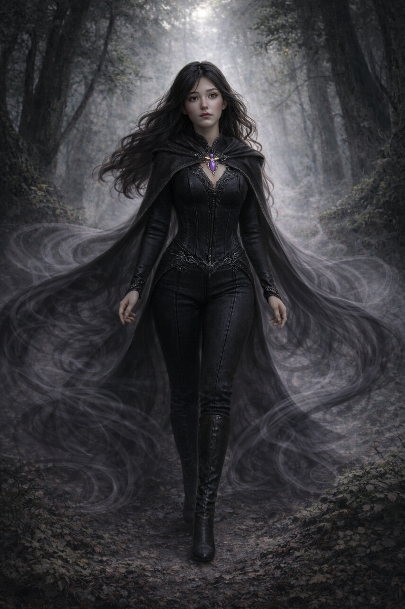

---
cssclasses:
  - wide-page
  - wide-backlinks
dateCreated: 2026-05-05
tags:
  - character
aliases:
  - odine
date:
image_name: OdineDunmere.png
species: Half-elf
age: 25
class: Warlock 2 / Sorcerer 3
---

  
  

## Background

Odine Dunmere is a 25-year-old half-elf from the [[Thornwood Vale]], multiclassed as a **Warlock 2 / Sorcerer 2**. She is descended from an ancient elven line, but her grandmother married a human, and her mother, Elira Dunmere, later married a half-elf named Etienne in an attempt to keep the bloodline balanced. Both of Odine's parents are still alive, and most of her ancestry going back roughly 1,400 years still lives within the Vale.

Odine loves the Vale and its people, but as a half-elf she is treated differently by many of its elves, almost like a second-class citizen. That prejudice became sharper after she was revealed as one of the "Touched," because the Vale now has to trust a half-human descendant with the role of binder and protector.

Odine left the Vale because the current blight is stronger than any before it. She hopes to find help, accelerate her understanding of her power, and learn how to bind the entity again, ideally forever.

## Thornwood Vale

Odine's people rarely leave the [[Thornwood Vale]] because the forest is, for elves, nearly perfect. The Vale's forest holds a power beyond their full understanding. After the elves arrived there about 1,300 years ago, they stopped aging and even returned to youthful bodies. The elders who first settled the Vale still live there. Source:

The Vale's immortality is conditional. If someone leaves, the gift ceases and their age can accelerate rapidly. Only younger elves under about 50 years old can leave safely, and even they must return within a few years or their lives begin to fade. The community remains isolated, though the men of the Vale sometimes leave to trade. The people call themselves the Guardians of the Vale.

The Guardians are matriarchal. Men are considered equals, but women naturally lead because of their ties to the magic of the Vale forest.

## Current Notes

- Odine carries a violet pendant that appears deeply important to her. [[Cassian]] noticed this while traveling to Everdale. Source: [[00 - Game Log/2026.05.05|2026.05.05]].
- The corrupted horse outside the Vale has made Odine fear that the entity's curse is spreading beyond the place she thought it was bound to.
- She is overwhelmed by Everdale and its customs, including meat-heavy city food and mead. Source: [[00 - Game Log/2026.05.05|2026.05.05]].
- Her reaction to [[Kardis Wulfhelm]] reflects the lower status half-elves hold in her home culture and the fact that half-elves would not normally lead there. Source: [[00 - Game Log/2026.05.05|2026.05.05]].
- She reluctantly joined the [[King's Tourney]] team, **Cassian's Crushing Crusaders**, despite not wanting to fight at first. See [[Compete in the King's Tourney]]. Source: [[00 - Game Log/2026.05.05|2026.05.05]].
- She met [[Gruvelda Duskbelt]], a dwarven smith who survived the same curse by amputating her own hand. Odine uncontrollably cast Message into Gruvelda's mind when she saw Gruvelda's preserved severed hand—a rare instance of her power acting without her conscious intent. She then revealed her own arm markings to Gruvelda. Gruvelda agreed to speak with her in detail after the first week of the festival. Source: [[00 - Game Log/2026.05.12|2026.05.12]].
- She used her innate sorcery in combat at the [[Stone Sanctum]] graveyard, casting Sorcerous Burst (lightning/thunder damage, 13 total, halved to 6 against the ghoul's resistance) with advantage and a +7 to attack. Her power surged when she feared for her companions. Source: [[00 - Game Log/2026.05.12|2026.05.12]].
- She freed [[Jevon]] from his rope bindings at the Stone Sanctum by trading her action to saw through the ropes. She healed him with Healing Word (9 HP) before freeing him. Source: [[00 - Game Log/2026.05.12|2026.05.12]].
- She holds one of two communication stones enchanted by Jevon. She can send him one short message and receive a telepathic reply. She is to use it at night when the party has a safe meeting place. Source: [[00 - Game Log/2026.05.12|2026.05.12]].
- She recognized Jevon's magical box as ancient elven craftsmanship—a relic, not a common trinket. Source: [[00 - Game Log/2026.05.12|2026.05.12]].
- In the party's first Proving Grounds bout, Odine cast Witch Bolt (24 to hit, 9 lightning damage), creating a visible arc to an enemy. She used Innate Sorcery (bonus action) to gain advantage on attack rolls for sorcerer spells and boost her spell save DC. She goaded an enemy attack to draw it off [[Cassian]], cast Armor of Agathus (5 temp HP; 5 cold damage to any melee attacker), and later re-cast it. After [[Cassian]] was revived, she discharged Witch Bolt as a bonus action (8 lightning), electrocuting an enemy into the ground. She ended the session casting Healing Word to revive Cassian (8 HP). Her magic came across as partly uncontrolled—she roleplayed an Eldritch Blast as erupting involuntarily from stress. Source: [[00 - Game Log/2026.06.02|2026.06.02]].
- Received a **Ring of Scorching Ray** from [[Duke Tristan Blackwood]]'s sponsorship delivery at [[Clover Hill]]; usable once per long rest. Source: [[00 - Game Log/2026.06.11|2026.06.11]].
- While retrieving [[Cassian]]'s cloak from the tailor, Odine noticed a **wooden straw doll** on the seamstress's dresser (Perception 15). Insight 22 revealed it had been given to the seamstress by [[Gruvelda Duskbelt]] when the seamstress's mother died. History 19 revealed the doll was approximately **100 years old** and originated from Odine's home region—the [[Thornwood Vale]]. The seamstress gave it to Odine freely. This doll belonged to the same cultural and magical heritage as Odine's family. Source: [[00 - Game Log/2026.06.11|2026.06.11]].
- At [[Gruvelda Duskbelt]]'s smithing tent, Odine presented the doll (natural 20 persuasion). Gruvelda revealed she had personally known **Mara**, Odine's grandmother—they met by the river when Gruvelda was young, collecting geodes, and became long friends. Gruvelda said Mara _"sacrificed herself"_ in a way that _"is no longer remembered by most humans."_ Gruvelda told Odine: _"You have been touched. Mara told me about your lineage and the burden you've borne."_ The lifespans of the Touched have been dwindling; Gruvelda feared none might remain. She confirmed the **hollowing** is spreading faster and has begun appearing in the Crown Lands. The king's reputed victory over it 150 years ago was, in Odine's words, a lie. Source: [[00 - Game Log/2026.06.11|2026.06.11]].
- Gruvelda gave Odine an **Elven Chain** (mithril chainmail undershirt of elven craftsmanship, not Gruvelda's own making): _"Wear it beneath your clothes. It will protect you."_ Source: [[00 - Game Log/2026.06.11|2026.06.11]].
- Her **Ring of Scorching Ray** from [[Clover Hill]] wouldn't attune correctly; she gave it to [[Azrith]], who used it as a "Ring of Fire Breath" (dragon-breath effect)—a discrepancy from the ring's original identification that remains unreconciled. During the [[Crown Gauntlet]], she cast Tasha's Hideous Laughter and a Silent Image illusory owlbear that routed two obstacle guards. Source: [[00 - Game Log/2026.06.23|2026.06.23]].
- In the Gauntlet's conclusion, Odine restrained a guard with **Mold Earth**, used **Gust** and a deliberately low **Fog Cloud** tactically, and landed two **Eldritch Blasts** (Repelling Blast)—drawing on her warlock levels. She closed the fight by casting Healing Word on the guard she'd just blasted unconscious, out of guilt. Source: [[00 - Game Log/2026.07.14|2026.07.14]].
- Received a **Shadowfell Shard** as part of [[Duke Tristan Blackwood]]'s Crown Gauntlet victory reward, and fused it onto her existing crystal pendant: as a spellcasting focus, using it with a Metamagic option lets her curse a targeted creature with disadvantage on checks/saves of one chosen ability score. Source: [[00 - Game Log/2026.08.11|2026.08.11]].
- Bought two Potions of Greater Healing (280 gp) from [[Marea Voss]]. Continues to support [[Jevon]] in hiding via the sending stone, including a 50 gp and mead cache left at a hidden drop point. Source: [[00 - Game Log/2026.08.11|2026.08.11]].
- During the long rest, Odine reflected on feeling far from her family in the [[Thornwood Vale]] but grounded by the friends around her. Source: [[00 - Game Log/2026.08.11|2026.08.11]].
- Gave [[Duke Tristan Blackwood]] her most direct explanation yet of her mission—"from beyond the veil," seeking to save her homeland from a crop-killing blight. Blackwood confirmed the blight has spread into the Crownlands themselves. Source: [[00 - Game Log/2026.08.18|2026.08.18]].
- Scouted **White Feather Tor** with a natural-20 Perception check, identifying a viable nighttime cliffside infiltration route to the Messenger Tent tied to [[House Godrin]]. Entered the King's Cup drinking tournament, rigged a side bet against her own success (Deception 14), reached exhaustion level 2, vomited, and bowed out. Cast **Spare the Dying** on [[Aldrich]] reflexively after his final failed save. Source: [[00 - Game Log/2026.08.18|2026.08.18]].
- Cleared her own exhaustion down to level 1 via a long rest alongside Aldrich's treatment. Helped bring the intercepted Godrin letter to [[Duke Tristan Blackwood]] and, on the spot, improvised a decoy to protect [[Maralynn]]: a fabricated name (**Erendel Morath**) and a false location deep in the [[Thornwood Vale]], backed by her own home-village charm pendant—removed from her necklace and handed to Blackwood—to make the lead convincing. Blackwood agreed to float it through his own channels as misdirection. Source: [[00 - Game Log/2026.08.25|2026.08.25]].
- In the manticore bout, landed a quickened Mind Sliver and a Thunderwave (16 thunder, halved on a successful Con save). When [[Cassian]] pivoted to freeing the manticore, cast **Cause Fear** on the loudest heckler in the crowd (failed save) to sow panic and distract the officials, publicly condemning the spectacle as "cold-blooded murder, not a test"—drawing a "she's a witch!" shout from the stands. Cast an illusory bowing manticore (Silent Image) in solidarity once the beast was freed. Source: [[00 - Game Log/2026.09.08|2026.09.08]].
- Read **[[Lady Elwyn Blackwood]]** with an Insight check (13) as a sharp social manipulator, distinct from her husband's strategist style. Grew wary of the camp's unfamiliar faces after the day's fallout and proposed the party start keeping night watches or find more secure lodging. Messaged [[Jevon]] via her sending stone to let him know the party was heading to [[Havenport]]. Kept first watch that night (Perception 19, safe), taking on an extra point of exhaustion for it. Reached **level 5** (Sorcerer 3 / Warlock 2); the GM pointed out her unusually high Deception and Intimidation modifiers go underused, prompting her to lean into a deliberately "naive-seeming but actually shrewd" persona going forward. Source: [[00 - Game Log/2026.09.15|2026.09.15]].

## Relationships

- [[Cassian]] noticed her pendant and the black tendril marks but did not press her.
- [[Marea Voss]] warned Odine to seek true sources about the pestilence and avoid those who exploit misinformation.
- [[Gruvelda Duskbelt]]: Fellow survivor of the corruption (Gruvelda by amputation). A key figure for the pestilence investigation. Source: [[00 - Game Log/2026.05.12|2026.05.12]].
- [[Jevon]]: Rescued him at the Stone Sanctum. Holds his communication stone. His teacher [[Maralynn]] is from the Thornwood Vale and may be connected to the pestilence.
- Elira Dunmere is Odine's mother and is still alive in the [[Thornwood Vale]].
- Etienne is Odine's father and is still alive in the [[Thornwood Vale]].

## Quests

- [[Investigate the Pestilence]]
- [[Rescue Jevon]]
- [[Compete in the King's Tourney]]
