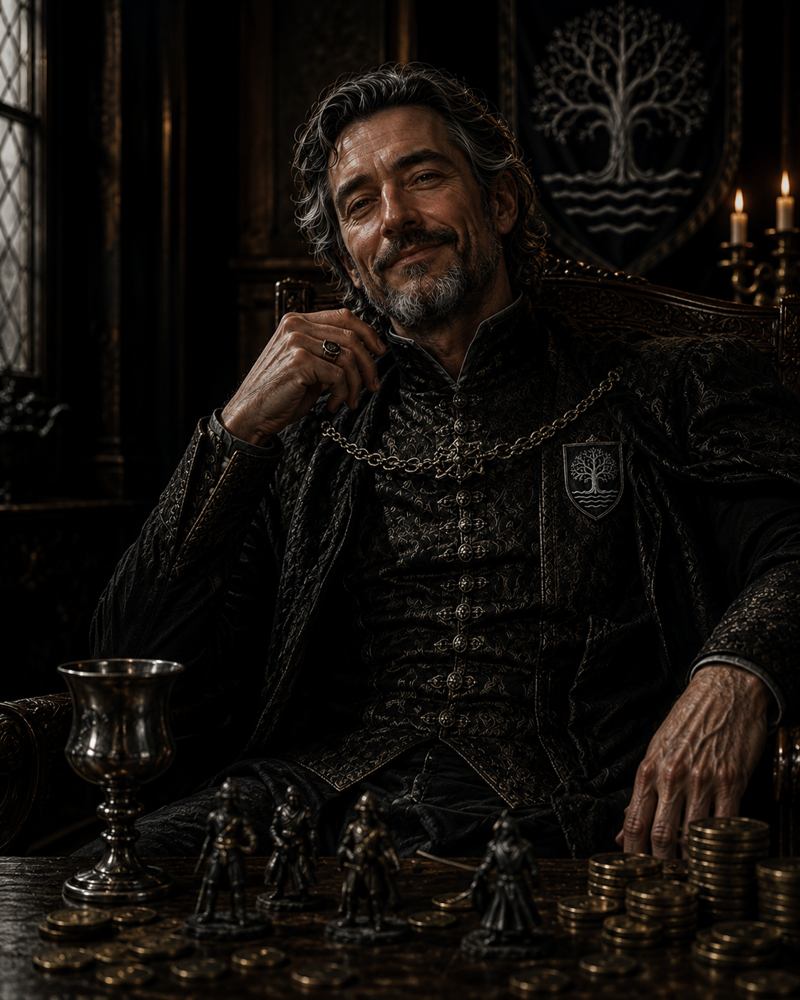

---
cssclasses:
  - wide-page
  - wide-backlinks
dateCreated: 2026-06-02
tags:
  - npc
aliases:
  - Tristan Blackwood
  - Duke Blackwood
date:
image_name:
---

# Duke Tristan Blackwood

  
  

## Summary

Duke Tristan Blackwood is a midlord of [[House Blackwood]], a vassal house that holds a smaller parcel of land loaned to them by one of the greater houses. House Blackwood is not one of the big three noble houses at the [[King's Tourney]] and does not typically win tournaments. Source: [[2026.06.02|2026.06.02]].

## Current Status

Present at the King's Tourney. During the party's first Proving Grounds bout, he walked from the noble box to the table with his goblet and began watching mid-fight. After the bout ended he gave [[Cassian]] a golf-clap acknowledgment and a valiant nod when their eyes connected. Cassian winked back. Following the bout, he formalized a **sponsorship deal**: 8% of any prize money in exchange for a 750 gp advance and four combat items (delivered at [[Clover Hill]]). The party attempted to negotiate down to 3% then 5% (persuasion with advantage, DC 22, rolled 14—failed); Duke Blackwood would not go lower than 8%. Source: [[2026.06.02|2026.06.02]], [[2026.06.11|2026.06.11]].

## Notes

- His level of nobility is comparable to [[Cassian]]'s family house—approachable, not a high lord.
- Watches from a red-tent section of the noble box at the Proving Grounds.
- He did not pay close attention to the match until partway through, when the fighting quality drew him in.
- [[House Blackwood]] is a **vassal of [[House Corwyn]]**, one of the three dominant houses at the tournament. Duke Blackwood operates within Corwyn's sphere of influence. Source: [[2026.06.11|2026.06.11]].
- [[Gruvelda Duskbelt]]'s assessment of him is blunt: _"Backwood—slimy bastard. Stay away from him."_ The party is now bound to his sponsorship despite this warning. Source: [[2026.06.11|2026.06.11]].
- Agreed to dig through his [[House Corwyn]] contacts for intelligence on [[House Godrin]]'s weaknesses—contingent on the party performing well in the [[Crown Gauntlet]]. Source: [[2026.06.23|2026.06.23]].
- Watched the party complete the Crown Gauntlet from the sponsor's box with only a slow, reserved clap—"amused and amazed" rather than jubilant, a notably muted reaction to his own sponsored team's biggest win yet. Source: [[2026.07.14|2026.07.14]].
- Sent his nephew and manservant, **[[Renny Blackwood]]**, to deliver the Gauntlet victory reward (~1,500 gp split among the party plus individualized magic items) along with an invitation to visit his tent that evening "to discuss business"—not yet acted on. Source: [[2026.08.11|2026.08.11]].
- Finally hosted the party at his tent on [[2026.08.18|2026.08.18]]: found with muddy boots up on his desk, smoking an "emberleaf" cigar (mundane relaxant, no magic). Dismissed his guards for privacy and asked each PC's origin story. Visibly surprised that [[Cassian]]'s house, [[House Fortescue]], is a [[House Wulfhelm]] vassal—he's never once heard Wulfhelm acknowledge them despite running in many circles, and pressed the point without getting a straight answer.
- Confirmed the blight/pestilence has spread beyond the [[Thornwood Vale]] into the Crownlands themselves, supplying the word "blight" himself when Odine described it obliquely.
- Delivered a major lore dump on the tournament's true stakes: [[House Godrin]] and [[House Wulfhelm]] have traded the Vale's deed between them for ~10 years; [[House Corwyn]] (his own liege house) believes the Vale hides a secret that could unite the lesser houses against Godrin and Wulfhelm. He personally would enjoy seeing all three great houses lose this year—unprecedented in a century. Framed the party's edge as "nobody owns you," distinct from being sponsored.
- Warned that [[House Godrin]] has been unusually active and is rumored to be **kidnapping children**; revealed that as a young competitor he personally witnessed Godrin abducting hedge mages, and wonders what frightened "one of the most powerful arcane families in the Crownlands" into resorting to kidnapping.
- Gave Cassian a **sealed intelligence note** (names/locations tied to Godrin's camp activity) and a second emberleaf cigar as a gift. Advised investigating at night. Source: [[2026.08.18|2026.08.18]].
- Reacted with visible alarm on [[2026.08.25|2026.08.25]] when shown a letter recovered from House Godrin's camp: he only knows the name **Marlin** (Maralynn) from folklore—an archmage who served **King Aldric the Wise**, presumed dead since "the ancient war." Concluded from the letter's contents that he has **a mole in his own camp** feeding House Godrin information, admitting he had "flirted with one of their nieces." Agreed to float a decoy name and location ([[Odine Dunmere]]'s fabrication, "Erendel Morath," backed by her family charm pendant) through his own intelligence channels to mislead Godrin. Source: [[2026.08.25|2026.08.25]].
- When [[Cassian]] freed the Menagerie's manticore instead of killing it—turning the crowd and officials against the party—Blackwood was seen quietly trying to slip out of the noble box, avoiding eye contact with the party for the first time. His reaction to sponsoring a team that just publicly disrupted the tournament is unresolved. Source: [[2026.09.08|2026.09.08]].
- **Privately delighted** by the outcome once alone with the party: drew a dagger dramatically before admitting "that was fucking genius." Chastised them for the gold spent but conceded their unplanned solution serves him better than anything he could have designed—the scandal makes the party "the perfect distraction" from his other dealings. Warned that mercy will eventually cost lives, and that the party must be prepared to answer for placing their own judgment above his orders. Unable to reward them financially while recouping his gambling losses, he sent them to [[Havenport]] under [[Captain Garan]]'s escort to let tensions cool. His wife, **[[Lady Elwyn Blackwood]]**, separately told the party she welcomed the change of pace. Source: [[2026.09.15|2026.09.15]].

## Relationships

- [[House Blackwood]]: His house, for which he serves as duke/midlord.
- [[House Corwyn]]: His liege house—though he's privately a wildcard rather than a loyal partisan.
- [[Cassian]]: Made eye contact with Cassian after the first bout; appears interested in the party's potential; suspicious of Cassian's evasiveness about House Fortescue.
- [[Renny Blackwood]]: His nephew and manservant/courier.
- [[Captain Garan]]: His captain of the guard.
- [[Lady Elwyn Blackwood]]: His wife.
